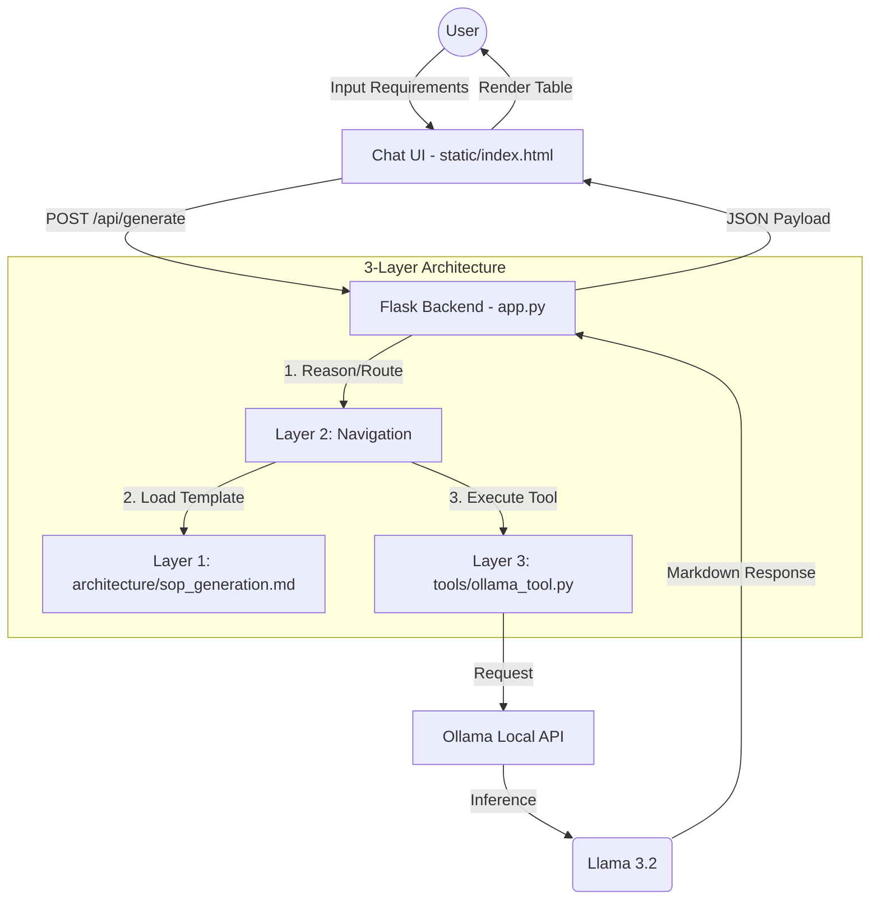

# 🧬 Local LLM Test Case Generator

A professional, local LLM-powered test case generator built with **Python (Flask)** and **Ollama (llama3.2)**. This tool provides a modern Glassmorphism UI to generate comprehensive QA test case tables from natural language requirements.

## 🚀 Features

- **Local LLM**: Uses `llama3.2` via Ollama for privacy and speed.
- **3-Layer Architecture**: Deterministic business logic separated from probabilistic LLM outputs.
- **Modern UI**: Dark-mode Glassmorphism design with responsive elements.
- **Structured Output**: Generates detailed Markdown tables (Positive, Negative, Boundary, and Security cases).
- **Exportable**: One-click "Download .md" and "Copy to Clipboard" functionality.

## 🛠️ Tech Stack

- **Backend**: Python, Flask
- **Frontend**: HTML5, Vanilla CSS, JavaScript
- **LLM Engine**: Ollama (Model: llama3.2)
- **Formatting**: Marked.js (Markdown rendering)

## ⚙️ System Workflow

The project follows a deterministic 3-layer architecture to handle probabilistic LLM outputs reliably.



## 📋 Prerequisites

1. **Ollama**: [Download and install Ollama](https://ollama.com/).
2. **Model**: Pull the required model:
   ```bash
   ollama pull llama3.2
   ```
3. **Python**: Python 3.11+ is recommended.

## 🏃 Getting Started

### Windows (One-Click)
Simply double-click the `run.bat` file in the root directory. It will:
1. Check for Python.
2. Install dependencies (`flask`, `requests`).
3. Start the server on `http://localhost:5000`.

### Manual Setup
1. Install dependencies:
   ```bash
   pip install -r requirements.txt
   ```
2. Start the application:
   ```bash
   python app.py
   ```
3. Open your browser and navigate to `http://localhost:5000`.

## 📂 Project Structure

- `architecture/`: Phase-based SOPs and logic definitions.
- `prompts/`: System templates for consistent LLM behavior.
- `static/`: Frontend assets (UI logic, styling, and structure).
- `tools/`: Atomic interaction scripts (Ollama wrapper, connection checks).
- `gemini.md`: Project Constitution and Maintenance Log.

## ⚖️ License
MIT License. Free for personal and commercial use.
